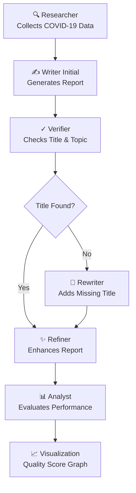

# 🤖 The Autonomous Agentic AI Framework: From Creation to Goal Execution  
### A Framework for Autonomous Multi-Agent Systems

---

## 📊 Overview

This project presents an **autonomous multi-agent AI framework** built using **CrewAI**, designed to simulate end-to-end task execution through collaborative intelligent agents.

The system demonstrates how multiple specialized agents can work together to:
- Gather information
- Generate structured content
- Validate outputs
- Correct errors
- Refine results
- Analyze system performance

Using an **iterative 3-stage pipeline**, the framework improves output quality over time and visualizes performance progression, showcasing **convergence behavior in autonomous systems**.

---

## 🚀 Features

- 🤖 Multi-Agent Collaboration (Researcher, Writer, Verifier, Analyst)
- 🔁 Iterative Workflow (Generation → Correction → Refinement)
- 📈 Custom Quality Scoring System
- 📊 Performance Visualization using Matplotlib
- ✅ Automated Verification & Self-Correction
- 🧠 AI-driven Workflow Analysis
- 🔍 Keyword-based Content Evaluation

---

## 🏗️ Project Structure
.
├── main.py # Main execution script
├── agentic_quality_curve_final.png # Generated performance graph
├── requirements.txt # Project dependencies
├── .env # Environment variables (API key)
└── README.md # Documentation

---

## ⚙️ Workflow Explanation

The framework operates through a **sequential multi-agent pipeline**:

1. **Research Phase**
   - Researcher agent gathers relevant information.

2. **Initial Writing Phase**
   - Writer agent generates a report (without title).

3. **Verification Phase**
   - Verifier checks:
     - Presence of title
     - Topic correctness

4. **Correction Phase**
   - If errors exist, Writer corrects structure (adds title).

5. **Refinement Phase**
   - Writer enhances:
     - Depth
     - Clarity
     - Coverage (vaccination, variants, etc.)

6. **Analysis Phase**
   - Analyst evaluates improvement across iterations.

7. **Visualization**
   - Graph shows quality score progression.

---

## 🔄 Iterations Overview

| Attempt | Phase        | Description                          |
|--------|-------------|--------------------------------------|
| 1️⃣     | Initial     | Generates base report                |
| 2️⃣     | Correction  | Fixes structural issues (title, etc.)|
| 3️⃣     | Refinement  | Enhances depth, clarity, completeness|

---

## 📊 Quality Evaluation

The system uses a **custom scoring function** to evaluate report quality:

### Evaluation Criteria:
- ✅ Presence of Title
- ✅ Verification Status
- 📏 Word Count
- 🧠 Sentence Complexity
- 🔑 Keyword Coverage:
  - lockdown
  - vaccination
  - variant
  - wave
  - testing
  - healthcare
- 🎯 Refinement Bonus
- 🎲 Controlled Randomness

**Score Range:** 50 – 95

---

## 📈 Output

### 📝 Generated Reports
- Initial Report  
- Corrected Report  
- Refined Final Report  

### 📊 Performance Graph
agentic_quality_curve_final.png


**Graph Shows:**
- Iteration Number vs Quality Score
- Improvement Trend
- Convergence Behavior

---

## 🧠 Agents in the System

| Agent        | Role |
|-------------|------|
| Researcher  | Collects factual information |
| Writer      | Generates and improves reports |
| Verifier    | Validates correctness and structure |
| Analyst     | Explains workflow improvements |

---

# Complete Repository Structure

The repository contains the following structure:

```
Sujal-SM-Autonomous-Agentic-AI-Framework/
├── docs/
│   ├── ...
├── src/
│   ├── ...
├── tests/
│   ├── ...
├── README.md
└── requirements.txt
```

# Workflow Flowchart

The workflow of the project can be visualized as follows:



# Enhanced Git Clone & Setup

To clone the repository and set up the project environment, follow these steps:

1. **Clone the repository**:
   ```bash
   git clone https://github.com/Sujal-SM/Sujal-SM-Autonomous-Agentic-AI-Framework.git
   cd Sujal-SM-Autonomous-Agentic-AI-Framework
   ```

2. **Set up a virtual environment**:
   For Python projects, it's recommended to use a virtual environment:
   ```bash
   python -m venv venv
   source venv/bin/activate  # On Windows use `venv\Scripts\activate`
   ```

3. **Install dependencies**:
   Install the required packages using pip:
   ```bash
   pip install -r requirements.txt
   ```

4. **Run the project**:
   Start the application with the command:
   ```bash
   python main.py  # Replace with the appropriate entry point
   ```
   
📜 License

This project is licensed under the MIT License.
